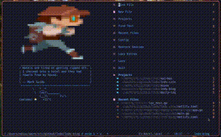
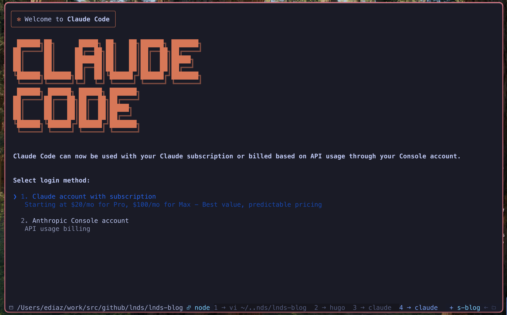

+++
date = '2025-07-27T18:46:02-04:00'
draft = false 
title = 'Al Principio Fue La Linea De Comandos'
+++
 
En su ensayo titulado "In the Beginning... Was the Command Line" (1999),
Neil Stephenson plantea que la GUI es una metáfora de la interposición de
abstracciones entre los humanos y la forma en que realmente actúan los computadores.

Una GUI muy popular entre programadores es el IDE, el Entorno  Integrado de Desarrollo,
lo llamamos. Existe porque programar se empezó a hacer cada vez más complicado.
Sobre todo con el surgimiento de los frameworks, y peor con los patrones de
desarrollo empresarial. Un ejemplo clásico es una aplicación empresarial en Java.

Por casi 20 años ejercí un rol ejecutivo como sub gerente de desarrollo,
y cuando me fui a una startup (Cornershop) como arquitecto,
empecé a trabajar con código con mucha más frecuencia de la que estaba acostumbrado.
Hasta entonces mi interacción con el código, era algún proyecto personal,
algún programa que escribía para mi blog, o un proyecto pequeño para la empresa
en que trabajaba.

Mi pasión es la programación, pero tengo que confesar que estaba bastante oxidado,
cosa que fue más notoria cuando entré a trabajar en Uber.
Así que tuve que reaprender muchas cosas, y mejorar en mis prácticas como ingeniero de software.

Así fue como hace 3 años tomé la decisión de hacer de la terminal mi principal
herramienta de trabajo. Quería aumentar mi productividad, y fue ahí cuando
volví a usar uno de mis
[editores de texto favoritos](/blog/lnds/2012/04/05/el-mejor-editor-de-texto-de-todo-el-mundo-mundial),
pero en su nueva encarnación: [NeoVim](https://neovim.io/).

Hay muchas razones por las que el uso del terminal te ayuda a mejorar tu productividad
como programador. Pero además, el no tener que salir de la terminal para editar tu código
es una razón muy poderosa para usar un editor de terminal como NeoVim. Pero no intentaré
convencerte de usarlo, si estás bien con Visual Code o lo que sea que uses, está bien.
Solo considera, cuántos minutos pierdes al día cambiando de contexto entre ventanas,
cuando evalúas eso, empiezas a mirar la terminal y NeoVim desde otra perspectiva.

## Incorporando la IA a mi flujo de trabajo

Este es el primero de una serie de artículos sobre cómo he adaptado mi flujo
de trabajo para  incorporar a la Inteligencia Artificial.
Hoy en día uso la IA para muchas cosas, pero empezaré
por contarles como terminé usándola para que me ayude a programar.

Si esta serie tiene éxito les contaré cómo la estoy usando en otras actividades
en mi otros aspectos de mi profesión y en mi vida personal.

Curiosamente, hay varios amigos y colegas que creen que yo no uso IA,
o que me opongo a su uso.
Principalmente por algunos de mis comentarios en LinkedIn.

La verdad que nunca me he opuesto a su uso, lo que ocurre es que he estado observando,
experimentando, y estudiando de forma concienzuda esta nueva tecnología, antes de
agregarla a mi caja de herramientas.

Sé que hay mucho entusiasmo y altas expectativas sobre sus habilidades, sobre todo de gente que no entiende cómo funciona y opera.

Cuando estudié para mi magíster, tomé un curso sobre ciencia de datos, y ahí
tuve la suerte de aprender con grandes académicos y científicos de la computación
expertos en estos temas.

El surgimiento de los transformers y sus capacidades no me sorprendieron para nada,
pues tenía los conocimientos para entender sus arquitecturas y leer estos avances.

Pero la ingeniería de software es mi especialidad y pasión, así que debía entender
en que medida los avances en IA van a impactar nuestra forma de construir software.

Hay que ir más allá del "Vibe Coding" y comprender no solo lo que tenemos disponible,
sino que evaluar cómo nos impacta, y también cómo lo que vendrá afectará en nuestros procesos.

Voy a abordar estos temas con varios artículos, siguiendo más o menos este
plan de publicación:

- Una introducción, este artículo que estás leyendo
- Mis experiencias usando la IA para programar
- La economía de la IA, donde comentaré sobre el costo de esta tecnología
- El cambio que debemos hacer en nuestros procesos de desarrollo
- Ideas sobre cómo formar a los nuevos ingenieros de software en un mundo post IA
- El futuro de la ingeniería de software y de nuestra profesión

## Claude Code es mi Copiloto

Supongo que entendieron el chiste.

Cuando Claude Code apareció me di cuenta que era lo que estaba buscando.
Puedes programar sin tener que salir de la terminal y no tocar el editor.
Tiene buena integración con varios IDEs, pero originalmente no existe una para NeoVim.
Pero por fortuna existe un
[plugin bastante bueno](https://github.com/coder/claudecode.nvim), desarrollado usando
esta misma herramienta.

¿Por qué no uso GitHub Copilot, o Cursor?

Existe mucho consenso en la comunidad que GitHub Copilot se ha quedado atrás.
Lo que me molesta de este, y de otras integraciones, es su modo autocompletar.
Hay que recordar que la IA "alucina" y no siempre te va a dar
la mejor solución, también toma caminos "extraños", eso se vuelve muy molesto
cuando trabajas en un modo en que tú y la máquina están compartiendo la edición
del código.

Es por eso que Cursor y otros editores terminan implementando una interfaz de chat.

El modo chat es la forma más natural de interactuar con la IA, también hablarle,
aunque eso es algo a lo que no me puedo acostumbrar, prefiero escribir las
instrucciones en una línea de comandos en el chat.
La gente de Anthropic entendió muy bien esto, en mi opinión.

Como no me gusta salir de la terminal, Claude Code es ideal para mi flujo de trabajo.
Pero también de los modelos que he usado, considero que Sonnet es muy bueno en tareas
de programación.

Pero la IA tiene sus límites y riesgos, y sobre estos pretendo hablar en el siguiente
artículo de esta serie.

Si te gusta el plan de publicación, te invito a suscribirte a mí
[Newsletter](https://Newsletter.lnds.net/), donde
avisaré cuando salgan los siguientes artículos de esta serie.

También tus comentarios me animan a seguir y aprender, seguro que muchos
de ustedes usan la IA de un modo distinto, y tienen experiencias diferentes
a la mía, compartamos estas impresiones entre todos.
