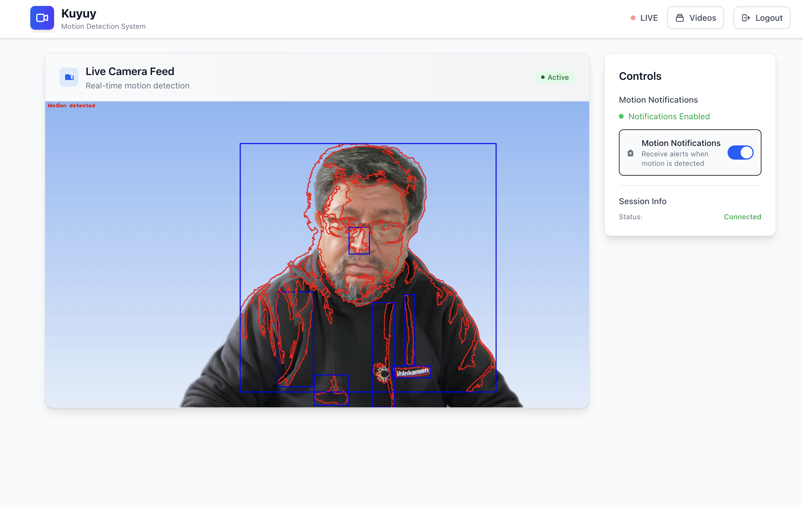
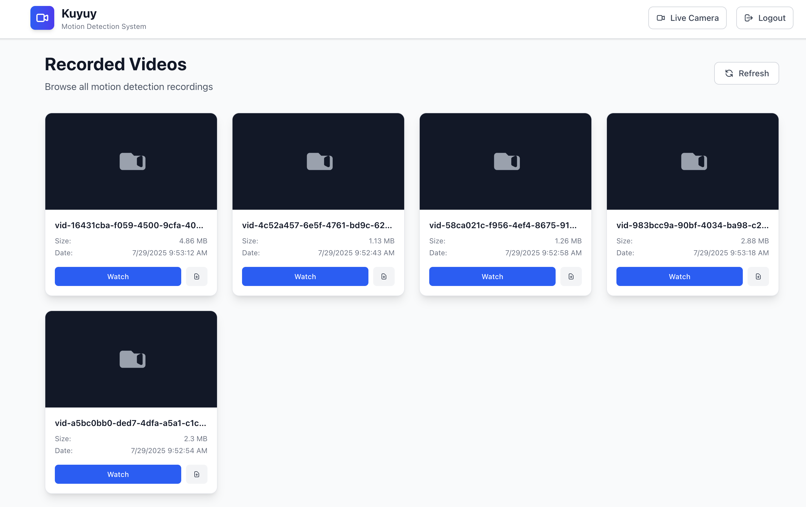

+++
date = '2025-07-29T08:13:42-04:00'
draft = false 
tags = ['IA', 'Claude Code', 'Agentes', 'Vibe Coding', 'Ingeniería de software']
title = 'To Vibe or not to Vibe, that is the question'
+++

El año pasado dicté un taller online en un bootcamp sobre algoritmos y estructuras de datos avanzados.

Fueron tres clases y en una les hablé de algoritmos de streaming.
Cuando menciono "streaming"
seguro que piensan en algo como Netflix o YouTube, pero no,
de lo que hablé fue de técnicas de back pressure, algoritmos de sketching,
ese tipo de cosas.

Pero no podía dejar a mis alumnos sin mostrarles como se hace el streaming de video,
así que escribí un [sencillo programa en Go](https://github.com/lnds/algoritmos-streaming/tree/main/stream-video)
que hacía "video streaming", y se los enseñé a mis alumnos.
Ese programa fue la semilla para un proyecto personal.

El problema que quería resolver es el streaming de una cámara de video,
y la detección de movimiento usando esa cámara.
La motivación es poder vigilar una casa que pasa parte del año desocupada.

Tenía una Raspberry-Pi y una cámara web HD como hardware.
Así nació el proyecto Kuyuy.
Según Google Translate kuyuy es movimiento en quechua.

Programando en el tiempo libre pude escribir un programa que captura el video,
hace streaming de este, y le agregué una rudimentaria detección de movimiento
usando Go y una biblioteca basada en [OpenCV](https://opencv.org/),
en pocas horas tuve algo que cumplía
el objetivo. Además el programa me notificaba los movimientos usando [Ntfy](https://ntfy.sh/).

Todo bien, pero eso requería una interfaz más decente,
y así fue como usé Claude Code
por primera vez. Totalmente en modo Vibe Coding. Le fui dando prompts para que creara
la interfaz de usuario web. Y el resultado me gustó mucho. Acá algunos pantallazos.

Kuyuy aún no está listo, pero pronto lo publicaré como proyecto opensource
antes de fin de año, y lo comunicaré por este blog y mi newsletter.

## Vibe Coding

Esta fue la primera vez que usé el algo similar al
concepto definido por Andrej Karpathy,
y debo confesar que fue asombroso.



Ahora bien, en este caso había una base y un plan claro de mi parte,
lo que me ayudó a guiar a la IA de forma efectiva.

Este experimento me convenció de que usar la IA con la experiencia de
un ingeniero senior es el camino. Porque detecté algunos problemas con
el vibe coding, que un usuario inexperto no considera:

- Seguridad, es el más evidente y sobre el que más se argumenta. El código
creado por la IA puede tener vulnerabilidades, y por default la IA no piensa en eso,
pero eso se puede controlar, y ahí viene la experiencia del programador.
- Mantenibilidad, si no le das guías sobre cómo codificar, con prácticas como
tests unitarios y de integración, linting, etc, la IA crea código de baja calidad.
- Arquitectura, las propuestas de la IA a veces son raras.
Yo sé que un "ingeniero senior", es en realidad un ingeniero mañoso que ha
aprendido en base a golpes que hay cosas que funcionan en la práctica,
y cosas que parecen buena idea en el libro, pero no lo son en el mundo real.
La IA en este momento del tiempo es una suerte de ingeniero junior,
pero más servicial y algo atolondrado.

Mi segundo proyecto personal usando Claude Code, fue un fracaso.
Llevo un tiempo usando una herramienta llamada [Doing](https://github.com/ttscoff/doing/wiki),
que me permite llevar una bitácora de trabajo diario (algo que recomiendo para mejorar
tu desempeño personal, y no olvidar las cosas que has hecho).

Doing está muy bien, este utilitario tiene algunos bugs y
decisiones que no me gustan, además está escrito en Ruby (horror),
así que no quise clonar el repo para modificarlo amis necesidades
(guacala, tocar código en Ruby, no, no no).

Así que empecé otra sesión de Vibe Coding con Claude.
Tenía interés de usar Rust con [RataTUI](https://ratatui.rs/),
un crate para crear [aplicaciones TUI](https://en.wikipedia.org/wiki/Text-based_user_interface)
uno de los requerimiento de mi aplicación, así que le pedí a la IA que usara este
paquete.
Mi idea era hacer un clone de Doing con una interfaz más atractiva
en la terminal.

Para controlar las iteraciones le pedí que creara test unitarios y de integración
siguiendo las prácticas más aceptadas en Rust.

Pero ahí descubrí mi gran error: **no preocuparme del contexto**.

## El contexto lo es todo

Resulta que Claude trata de ejecutar pruebas
corriendo el programa, así que son pruebas destructivas.
En mi caso, estaba operando sobre el archivo de bitácora de la aplicación.
Así que cuando yo probaba  la aplicación, mi archivo se perdía.

Entonces le pedí que aplicara mocks en los tests unitarios, con la esperanza
de que no destruyera los archivos. Como estaba en modo _vibe_, no me preocupé
por la arquitectura que estaba implementando la IA, y esta resultó
ser un desastre.

Ahí fue que decidí que la IA debía refactorizar el código, pero ya era tarde.
Traté de agregar documentación de TUI, sobretodo como probar aplicaciones
creadas con este framework, y fue para peor.
Los tests tomaban mucho tiempo, y empezó a
agregar toneladas de [flaky tests](https://www.jetbrains.com/teamcity/ci-cd-guide/concepts/flaky-tests/),
que además se traslapaban entre sí, lo que la llevó a implementar exclusión
mutua en el código. Todo se complicó y pasé más tiempo tratando de
arreglar los tests que avanzar en features.

Entonces, es super importante darle mucho contexto a la IA de lo que quieres hacer,
esto lo tenía en el caso de Kuyuy, pero en este segundo experimento fui
muy flojo con esto. Tratar de arreglar la arquitectura en el camino
no funcionó, así que tomé la decisión de abandonar el proyecto y
partir de cero.

Esta vez le pasé el link del repo original de Doing, especifiqué mejor
lo que quería hacer y creamos un plan en fases para clonar el
comportamiento de la aplicación.

Como Doing es una [cli](https://en.wikipedia.org/wiki/Command-line_interface), cada comando tiene su help, por ejemplo,
puedes hacer `doing help tags` y obtienes la ayuda de cómo funciona
el comando `tags` en doing.
Entonces, en cada fase le pedí a Claude que usara esta técnica
para que entendiera cómo implementar cada comando.
También puse más atención a la arquitectura.

Esta nueva versión maneja el comando como una entidad, un objeto si quieren,
especializada que puede ser usado tanto en la cli como en la tui.

Esto permitió mejorar el testing, y el refactoring.

En un momento corrí [clippy](https://doc.rust-lang.org/clippy/usage.html)
y detecté que Claude es fan de crear funciones
con muchos argumentos (algunos sobre los treinta!).
Eso es un code smell
grande y muestra que probablemente no estamos creando entidades intermedias
útiles, o faltan ciertas abstracciones.

Decidí no ser tan duro, peri sí le exigí que refactorizara esas funciones,
lo que gracias al uso de tests se pudo hacer en unos minutos extra.

Para comparar, la anterior versión, que considero un fracaso y que boté
me tomó unas 12 horas a lo largo de 10 días, y apenas implementé un 25%
de la funcionalidad. La nueva, la empecé ayer, antes de escribir estas
líneas, he invertido 3 horas y ya están implementadas 8 de las 10
fases planeadas.

## Confía pero controla

Claude Code es una herramienta poderosísima, pero puede costarte caro
a la larga si no mantienes buenas prácticas.

La IA tiene un contexto limitado, y hay que aprovecharlo bien.
Debes ayudarla, pero no sobre cargarla. Las limitaciones que tiene actualmente
te obligan a actuar de forma estratégica y táctica al programar.
Pero siempre ha sido así,¿verdad? ¿¿¿verdad???

El Vibe Coding puede estar bien para una demo, un prototipo, pero probablementej
ese código va a ser inmantenible, y probablemente poco escalable e inseguro.

Usa a la IA como una ayuda, pero controla el código que produce. Es atolondrada,
se olvida que debe actualizar los tests, o que debe agregar.

Pero se puede manejar, y cuando la dominas te ayuda mucho a ser productivo.

Hasta ahora he hablado sobre cómo he usado la IA en proyectos personales, pero
no les he comentado como la uso en mi trabajo. Un tema que mencionaré en el
tercer capítulo de esta serie.

Por ahora los dejo con mi proyecto: [Daily-Log](https://github.com/lnds/daily-log)
que si se animan pueden usar y me comentan si les sirve.

También los invito a compartir este post a sus colegas y amigos, a inscribirse
en mi [newsletter](https://newsletter.lnds.net/) para apoyar mi trabajo,
es gratis, pero también hay una versión de pago que pueden suscribir si se animan.

Gracias por leer, y espero tus comentarios, comparte tu experiencia con la IA programando,
estamos todos aprendiendo y compartir nos hace crecer a todos.
