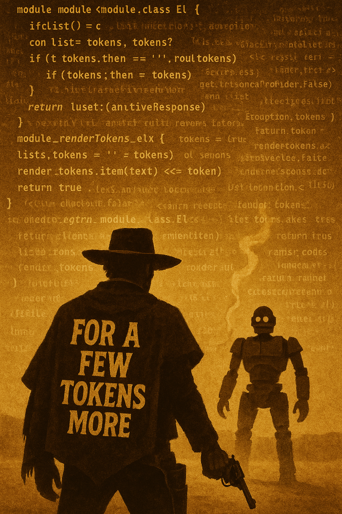

+++
date = '2025-07-30T09:10:15-04:00'
draft = false
title = 'Por unos pocos tokens más'
+++

En mi trabajo actual varios de mis colegas usan Cursor, yo lo bajé pero nunca llegué a instalarlo.

Hace tiempo que abandoné Visual Studio Code y no iba a volver a un clon para integrar IA en mi
workflow. Como ya les conté, estaba usando Neovim, y de ahí no quería moverme,
pero los plugins no me convencían, tampoco mucho la idea de un copiloto que escribiera
código por mi. Probé Avante un tiempo, y ahí fue cuando lo configuré para que usara
la API Keys de ChatGPT y de Claude.

Y empezaron las preocupaciones, aparte de que el plugin Avante tenía varias pifias,
me topaba con los rate limits, y también con el hecho de que el gasto empezaba a
subir.

Quizás en el futuro la economía se va a basar en los tokens como unidad de intercambio,
o unidades de procesamiento, o algo que refleje el uso de la IA (esto bajo el supuesto
de que el esta tecnología será central en nuestras actividades).

Así que sospecho que van a crearse mercados de tokens alternativos,
robos de API Keys, o gente compartiendo sus cuentas en Claude Code
como se comparten las cuentas de Netflix.

Ya está pasando, y de hecho esta semana la gente de Anthropic envió un email indicando
que van a poner cuotas semanales a su producto estrella.

El token es el nuevo dolar, al menos para los programadores.

Partí usando Claude Code Pro, que cuesta unos 20 dólares, y ya me encuentro experimentando
con las versiones Max. Porque es como una droga.

Pero en mi caso, aparte de lo entretenido y desafiante que es lidiar con la IA como
asistente, lo que me interesa es investigar su impacto en nuestra profesión, y medir
en terreno que tan útil es en verdad.

Por ahora, creo que si las empresas asignan una cuota de 100/200 dólares a sus
ingenieros para que usen estas herramientas, esperan un impacto.

Queremos saber cuál es el ROI de la IA, en buenas cuentas.
¿Se puede saber?

Se me ocurren algunas ideas para medirlo, y en parte esa es la razón por la que
estoy en esta investigación

## Calla y llévate mi dinero

Los modos pro y el mod Max de Claude Code parecen ser una forma adecuada para
manejar este gasto a nivel empresarial. Sabes que puedes asignar 1200 a 2400
dólares anuales por ingeniero, eso son como medio a un dólar extra
por hora de trabajo.

En Estados Unidos y algunas partes de Europa, el costo empresa
de allá un ingeniero senior está muy por encima los cien mil dólares anuales,
así que el extra de costo empresa es bajo el 1%.

En Latam los sueldos más altos no superan los 100.000 dólares promedio,
quizás están más cerca de los 80.000 para seniors, y de ahí para
abajo. No tengo datos, y puedo estar equivocado, tampoco he investigado
para este post, sólo estoy haciendo un cálculo de servilleta.

Asignarle la cuota de uso Max de Claude Code a cada ingeniero tiene
un impacto de un 2,5%, asumiendo los números recién mencionados.

Pero, si gastamos eso como empresa, ¿vamos a tener un retorno que
justifique esa asignación?

¿Qué opinan ustedes?

## Ayudame IA, eres mi última esperanza

Voy a contar mi caso personal, mi cargo actual se divide en parte
liderazgo de equipo, apoyo al área comercial, dirección técnica y
desarrollo de producto. En este último aspecto tengo que desarrollar
software, pero no es el 100% de mi tiempo, por ahora diría que
está entre el 60 y 70% de mi tiempo.

Decidí tomar un proyecto de envergadura media a alta, y durante
semanas avancé muy poco, como tortuga. Empecé a usar Claude Code
y llegué a producir en promedio tres pull requests diarios
durante la última semana, lo que me permitió terminar el proyecto,
con retraso, pero no tanto con lo que podría haber sido.

A diferencia de los proyectos personales, acá había una base de código
en Elixir mucho más grande. Este proyecto en particular era un
servicio nuevo, que se encontraba en el 70% de desarrollo, yo
debía terminarlo. Aproveché que hay una herramienta
nueva [Tidewave](https://tidewave.ai/) que fue desarrollada
por el mismisimo equipo de Phoenix, dirigido por
ese monstruo que es José Valim.

Tidewave es un MCP que corre en tu código, acá les dejo la
demo para que vean lo que puedes hacer con esta herramienta:



Con ese nuevo super poder pude mejorar, re arquitecturar varias
cosas e incluso re pensar el flujo de operación que tendría el
producto.

Y voy a seguir usando esta tecnología en mi trabajo, creo que
me ayuda mucho y sí, me hace más productivo.

Pero  ojo, dado que tengo muchos años de experiencia,
entiendo como funciona la IA,
y no me trago todo lo que dicen los vende humos, no
estoy tan seguro que el resultado sea el mismo para todos.

Creo que hay que tener un método para usar la IA, y estoy
trabajando en eso, y de eso les hablaré en el siguiente
post de esta serie.

Como siempre, les agradezco que hayan llegado hasta acá,
que compartan, y mejor si se suscriben a mi [newsletter](https://newsletter.lnds.net/).
