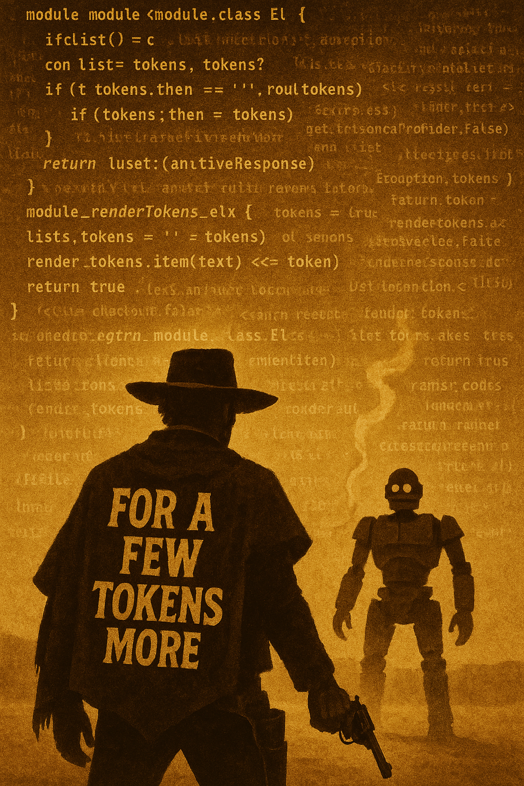
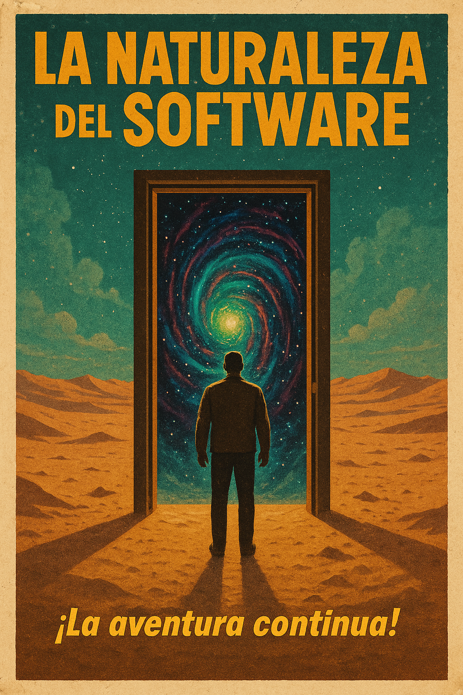

+++
date = '2025-08-01T08:36:43-04:00'
draft = false
title = '20 Años'
slug = '2025-08-01-aniversario-20'
+++

Este blog cumple 20 años hoy.

El 1 de agosto de 2005 publiqué [el primer post oficial](blog/lnds/2005/08/01/desarrollar-software-es-como-hacer-una-pelicula/) de La Naturaleza del Software.

Era el boom de los blogs, aún faltaban unos años para
que llegaran las redes sociales y arruinaran nuestra
vida digital.

Somos pocos los que aún mantenemos blogs personales en Chile.
Y si no estoy equivocado, junto con [el de Alejandro Barros](https://www.alejandrobarros.com/),
este es el blog más antiguo en nuestro país.

Si bien es cierto en el último par de años moví mucho
de mis publicaciones a mi [Newsletter](https://newsletter.lnds.net), nunca pensé en
abandonar este espacio. Pero no me había tomado el
tiempo y tampoco tenía la motivación para poder seguir
escribiendo.

Pero eso ha cambiado, estoy muy motivado y lo pueden notar en
que esta semana he publicado, contando este, cinco artículos.
Los primeros cuatro centrados en mi experiencia
incorporando la IA en mi trabajo.

Si les interesa leerlos, la serie consiste de los siguiente artículos:

- [Al principio fue la línea de comando](/blog/lnds/2025/07/27/al-principio-fue-la-l%C3%ADnea-de-comandos.../)
- [To Vibe or not To Vibe](/blog/lnds/2025/07/29/to-vibe-or-not-to-vibe-that-is-the-question/)
- [Por unos tokens más](/blog/lnds/2025/07/30/por-unos-pocos-tokens-m%C3%A1s/)
- [Confía en el proceso](/blog/lnds/2025/07/31/2025-07-31-confia-en-el-proceso/)

En cada artículo exploro algún aspecto del uso de la IA para desarrollar software.
En particular mis observaciones usando Claude Code.

Vivimos tiempos interesantes, eso es bueno y malo. Recordemos que hay
una vieja maldición china que justamente habla de vivir tiempos interesantes.

La IA plantea grandes desafíos, también está generando expectativas exageradas.
Hay temores, algunos infundados, y otros no.

Siento que es tiempo de que este blog vuelva a ser una voz escuchada,
que recupere la posición que tuvo en algún momento en la comunidad
tecnológica chilena, y latinoamericana.

Hay muchos vendedores de humo, tecno influencers buenos y malos,
contenido generado por IA, sin alma ni la perspectiva humana.

Tengo muchas cosas que decir sobre lo que está pasando en
tecnología, y siento que hay muchos colegas que se sienten abrumados
o desorientados. Me gustaría ayudarlos y orientarlos.

Se me ocurren muchas ideas y acciones a realizar, pero vamos a ir
paso a paso. Primero manteniendo la regularidad de publicación.
Seguiré manteniendo el Newsletter, aunque quizás lo migre de plataforma
pues siento que los valores de Substack no está alineado con los míos.

Será una aventura interesante la que nos espera en los próximos veinte años.

Te invito a acompañarme, y gracias por seguir ahí leyendo.

(*) imágenes del post generadas con IA usando ChatGPT.
