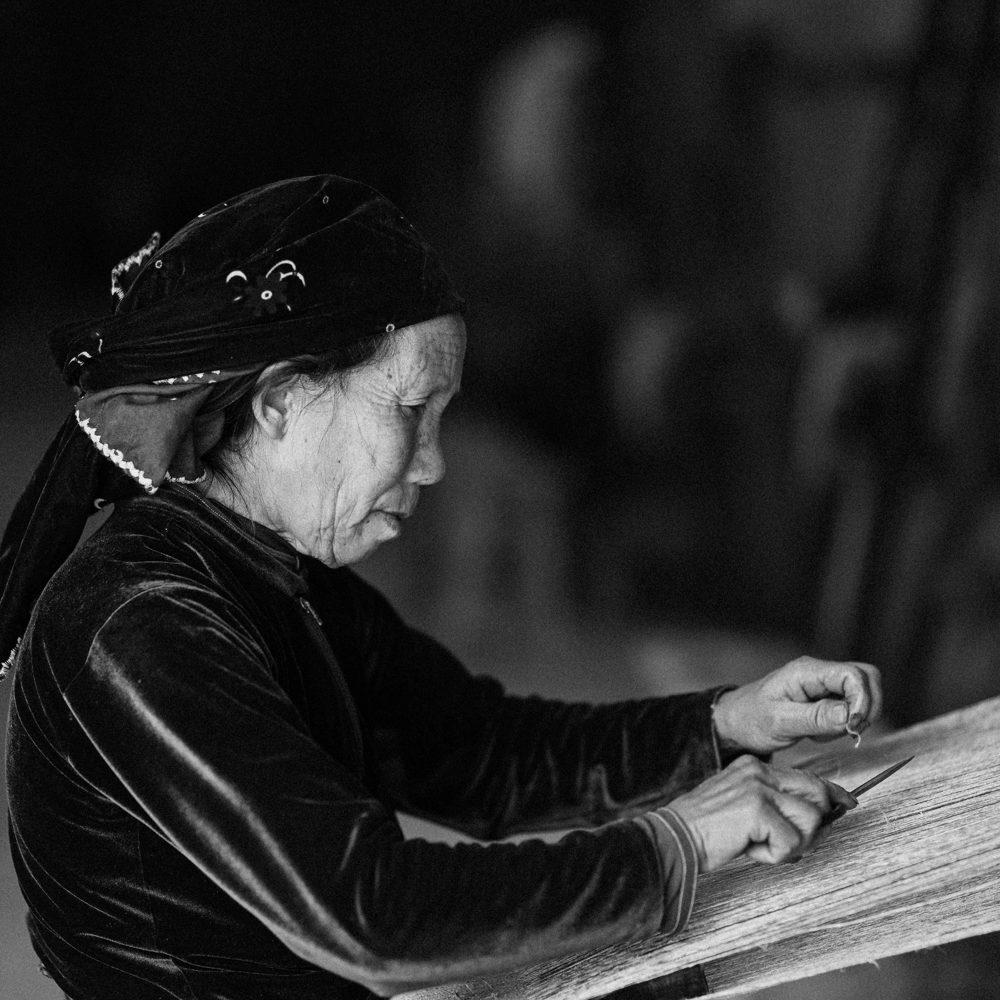

+++
date = '2025-08-27T10:00:00-04:00'
draft = false
title = 'El Fin del Software Artesanal'
tags = ['IA', 'desarrollo', 'industria', 'historia', 'programación']
slug = '2025-08-27-el-fin-del-software-artesanal'
+++

Recientemente un colega se refería a cierta empresa expresando que su proceso de desarrollo era "muy artesanal", y no se trataba de un cumplido.

# La paradoja de lo artesanal

Es curioso cómo una misma palabra puede tener connotaciones tan opuestas. Cuando compramos cerveza artesanal o muebles artesanales, pagamos un extra, porque esperamos una calidad superior, premium como dicen ahora.

Lo artesanal implica cuidado, atención al detalle, calidad superior. Cada pieza es única, hecha con dedicación por manos expertas.

Hace años se puso de moda el concepto ["software craftmanship"](https://en.wikipedia.org/wiki/Software_craftsmanship), que era esta visión positiva, de preocupación por la "belleza" y calidad del software.

Pero, hoy en general, cuando alguien dice que tu software es "artesanal", te está diciendo que eres un amateur. Que no tienes procesos. Que dependes demasiado del talento individual. Que no puedes escalar. Que cada proyecto es una aventura impredecible.

Y tienen razón.

Durante décadas hemos tratado de industrializar el desarrollo de software. Intentamos con las metodologías en cascada, con RUP o con CMMI. Después vinieron las metodologías ágiles, que paradójicamente celebraban cierto retorno a lo artesanal: "individuos e interacciones sobre procesos y herramientas".

Pero ahora, con la llegada de la IA generativa, finalmente estamos entrando en la verdadera era industrial del software.

# Los telares de Jacquard del siglo XXI

En 1801, [Joseph Marie Jacquard](https://es.wikipedia.org/wiki/Joseph_Marie_Jacquard) inventó un telar que podía tejer patrones complejos automáticamente, controlado por tarjetas perforadas. Fue una de las primeras máquinas programables de la historia. Los tejedores artesanales, que habían dominado el oficio por siglos, de pronto se encontraron compitiendo con máquinas que podían producir telas más rápido y más barato.

No todos desaparecieron. Los mejores se adaptaron, se convirtieron en diseñadores de patrones, en operadores especializados, en supervisores de calidad. Pero el oficio cambió para siempre.

Claude Code, Cursor, Copilot, y todas las herramientas de IA generativa son nuestros telares de Jacquard. Y nosotros somos los tejedores.

En [2009 escribí sobre la programación como arte](/blog/lnds/2009/12/01/la-programacion-como-un-arte-parte-i/), traduciendo a Knuth. Distinguía entre el artesano, que usa sus herramientas para servirse, y el artista, que trasciende el medio. Pero ahora enfrentamos algo diferente: la industrialización masiva del acto de codificar.

# De artesanos a operarios especializados

El vibe coder que mencioné en posts anteriores no es un artesano. Es un operario de la nueva fábrica de software. No necesita entender los fundamentos profundos del lenguaje, ni las sutilezas de los algoritmos. Solo necesita saber formular buenos prompts y validar que el output funcione.

Y eso no está mal. La industrialización trajo prosperidad. Más gente tiene acceso a más productos. La democratización de la creación de software significa que más problemas serán resueltos, más ideas serán implementadas.

Pero también significa que el software "hecho a mano", línea por línea, con cuidado y comprensión profunda, será cada vez más raro. Y como todo lo artesanal cuando llega la industrialización, será más caro y para nichos específicos.

# Lo que perdemos, lo que ganamos

Los defensores de la IA te dirán que no perdemos nada. Que los programadores simplemente suben de nivel, que ahora podemos enfocarnos en la arquitectura, en el diseño, en los problemas realmente difíciles. Que la IA se encarga de lo tedioso.

Los críticos te dirán que perdemos la comprensión profunda, que creamos una generación de programadores que no entienden lo que hacen, que cuando la IA falle no sabrán arreglar nada.

Ambos tienen razón.

En la transición a la era industrial siempre hay pérdidas. Se pierde el conocimiento tácito, la intuición que viene de años de práctica, el orgullo del artesano. Pero se gana en productividad, en accesibilidad, en velocidad.

Los militares alemanes en 1940, como [mencioné en otro post](/blog/lnds/2021/03/28/gestion-del-conocimiento/), creían que les tomaría a los aliados una generación formar "artesanos ópticos" capaces de igualar su calidad. No contaban con que los americanos industrializarían el proceso. No necesitaron artesanos; necesitaron fábricas.

# El futuro es industrial, nos guste o no

Podemos resistirnos, podemos romantizar el pasado, podemos insistir en que el verdadero software se escribe a mano. Pero la historia nos enseña que la industrialización es inevitable cuando la tecnología lo permite.

Los que prosperarán serán los que entiendan esta transición y se adapten. No como víctimas, sino como protagonistas. Los que aprendan a dirigir las máquinas, a diseñar los procesos, a garantizar la calidad.

Porque al final, alguien tiene que diseñar los patrones que los telares tejerán. Alguien tiene que decidir qué vale la pena construir. Alguien tiene que entender el sistema completo cuando las máquinas fallen.

Ese alguien puede ser un artesano que se adaptó. O puede ser alguien nuevo que nunca conoció el mundo anterior.

La era del software artesanal está terminando. No con un bang, sino con un prompt.

---

*¿Qué piensas de esta transición? ¿Eres de los que abraza el cambio o de los que defiende el antiguo arte? Me interesa conocer tu opinión. Puedes comentar acá o suscribirte a mi [newsletter](https://newsletter.lnds.net).*
