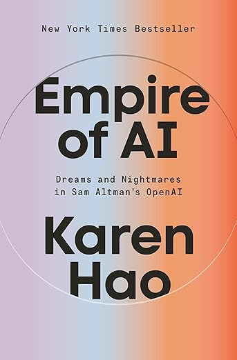

+++
date = '2025-10-07T22:06:55-03:00'
draft = false
title = 'Ciencia Cautiva: El Caso Timnit Gebru y la Censura en Big Tech'
slug = 'ciencia-cautiva'
tags = ['IA', 'ética', 'big tech', 'investigación']
+++

> "Have you ever heard of someone getting 'feedback' on a paper through a privileged and confidential document to HR? Or does it just happen to people like me who are constantly dehumanized?"
>
> — Timnit Gebru, en email interno a Google Brain, noviembre 2020

El 2 de diciembre de 2020, mientras la industria tecnológica celebraba los avances de GPT-3 y el boom de los modelos de lenguaje masivos, un tweet detonó una crisis que reveló hasta qué punto Big Tech han llegado a controlar la investigación en IA. Timnit Gebru, investigadora etíope de Stanford y co-líder del equipo de IA ética de Google, anunciaba su despido. El motivo: atreverse a cuestionar la carrera desenfrenada por modelos cada vez más grandes.

La historia de Gebru no es un caso aislado de conflicto laboral. Es el síntoma de una transformación profunda en cómo se hace investigación en IA: de la academia abierta a los laboratorios corporativos cerrados, de la crítica científica a la complacencia comercial.



Esta historia, que se detalla en el capítulo 7 del libro ["Empire of AI"](https://amzn.to/3KCK2Mh) de Karen Hao, es muy reveladora.

## El Paper que Molestó a Google

Todo comenzó con un paper llamado "On the Dangers of Stochastic Parrots: Can Language Models Be Too Big? 🦜" (*¿Pueden los modelos de lenguaje ser demasiado grandes?*). Gebru y sus coautoras —entre ellas Emily Bender, profesora de lingüística computacional en la Universidad de Washington— habían documentado cuatro problemas fundamentales de los modelos masivos de lenguaje:

1. **Impacto ambiental**: El entrenamiento de estos modelos genera grandes emisiones de carbono. En un planeta en crisis climática, esto no es un detalle menor.

2. **Basura tóxica a escala**: Al entrenar con todo lo disponible en internet, incluyendo Reddit, 4chan y foros que Gebru, como mujer negra, evitaba precisamente por el acoso sistemático, estos modelos amplificaban sesgos racistas, sexistas y discursos de odio.

3. **Opacidad total**: Los datasets son tan masivos que resulta imposible auditarlos. Nadie sabe realmente qué contienen.

4. **La ilusión del significado**: Los outputs son tan buenos que la gente confunde patrones estadísticos con comprensión real, convirtiendo a estos sistemas en supuestos "consejeros confiables".

Nada de esto era particularmente controversial en términos académicos. De hecho, citaba investigación previa bien establecida. Pero había un problema: Google había inventado el Transformer, la tecnología base de GPT-3, y lo usaba en su producto más lucrativo: Google Search.

Criticar los modelos masivos de lenguaje era criticar el futuro del negocio.

## El Proceso Kafkiano

Lo que ocurrió después es una nos muestra cómo opera la censura corporativa moderna. Una semana antes del Día de Acción de Gracias de 2020, Gebru recibió una invitación de calendario sin explicación: reunión con Megan Kacholia, VP de ingeniería de Google Research, en tres horas.

La reunión duró 30 minutos. Kacholia fue directa: Gebru debía retractar el paper.

No era una solicitud de revisión. No era un pedido de aclaraciones. Era una orden de retracción total.

Gebru preguntó lo obvio: ¿Quién había objetado? ¿Podía hablar con ellos? ¿Podía revisar secciones específicas? ¿Podía publicarlo bajo otra afiliación?

No, no y no.

Tenía hasta el día después del feriado para retractarse. Gebru lloró al final de la llamada.

En lugar de disfrutar con su familia, Gebru pasó el Día de Acción de Gracias escribiendo un documento rebatiendo cada objeción. La respuesta de Google fue glacial: retracta el paper o quita los nombres de los autores de Google.

Gebru respondió que lo haría bajo dos condiciones: que le dijeran quién había dado el feedback y que establecieran un proceso transparente para revisar investigación futura. Si no, renunciaría después de ayudar a su equipo en la transición.

Google interpretó esto como una renuncia inmediata y la despidió esa misma noche, mientras ella manejaba en medio de un viaje por carretera en Texas.

## La Normalización de la Censura

Lo verdaderamente revelador del caso Gebru no es solo que Google haya censurado el paper. Es que lo hizo en un contexto donde OpenAI ya había legitimado el secretismo corporativo.

Con GPT-2, OpenAI argumentó que el modelo era "demasiado peligroso" para publicar. Con GPT-3, publicaron un paper "sanitizado" con casi cero información sobre cómo fue entrenado, algo que antes se consideraba el mínimo académico.

El mensaje a la industria fue claro: ya no es necesario ser transparente. Y Google aprendió muy bien esa la lección.

Después de ChatGPT, la opacidad se volvió norma. En 2023, investigadores de Stanford crearon un tracker de transparencia para evaluar si las empresas de IA revelaban información básica sobre sus modelos: número de parámetros, datos de entrenamiento, verificación independiente.

Las diez empresas evaluadas —OpenAI, Google, Anthropic incluidas— sacaron F. La nota más alta fue 54%.

## Big AI = Big Tobacco

Para Karen Hao, el despido de Gebru es un símbolo de un problema mayor: Big AI está siguiendo el camino de Big Tobacco. Concentración de recursos, distorsión de la investigación, censura de estudios críticos.

Dos investigadores lo plantearon directamente: la industria de IA está actuando exactamente como las tabacaleras en los años 60 y 70, suprimiendo investigación que amenaza sus intereses comerciales.

El caso ilustra tres patologías del ecosistema actual:

**1. Concentración total del poder de investigación**: Solo las Big Tech tienen los recursos computacionales para entrenar modelos masivos. Esto les da control absoluto sobre qué se investiga y qué se publica.

**2. Diversidad inexistente en espacios de poder**: Gebru había co-fundado "Black in AI"", organización que visibilizaba investigación relevante para comunidades marginadas. Su equipo de IA ética era uno de los más diversos de Google. Su despido eliminó esa voz crítica.

**3. Cero protección para whistleblowers**: Tres meses después, Google despidió también a Meg Mitchell, co-líder del equipo de IA ética, por descargar emails relacionados con el caso Gebru. El mensaje: quien hable, se va.

## La Obsesión de Jeff Dean

Hay un detalle interesantes en toda esta historia: [Jeff Dean](https://es.wikipedia.org/wiki/Jeff_Dean), el legendario ingeniero de Google, uno de sus primeros empleados y figura venerada en la comunidad de IA, nunca pudo superar el paper de "Stochastic Parrots".

Años después del despido de Gebru, Dean seguía obsesionado con una sección específica: el cálculo de la huella de carbono del modelo Evolved Transformer, basado en la investigación de [Emma Strubell](https://es.wikipedia.org/wiki/Jeff_Dean).

Dean argumentaba que Strubell había sobreestimado las emisiones de Google 88 veces porque usó GPUs estándar en sus cálculos, cuando Google usaba TPUs más eficientes. Empleados de Google se burlaban en privado diciendo que esta objeción estaría inscrita en su tumba.

El problema: Strubell nunca afirmó estar calculando las emisiones reales de Google. Google nunca había publicado esos datos. Strubell hizo una estimación basada en hardware estándar de la industria, precisamente porque Google no era transparente.

Entonces Google culpó a Gebru por citar estimaciones públicas en lugar de datos internos que la empresa nunca había revelado y que, además, le prohibieron buscar antes de despedirla.

Un [catch-22](https://en.wikipedia.org/wiki/Catch-22_(logic)) perfecto cuyo único resultado posible era la censura.

Dean posteriormente invitó a Strubell a participar en un paper "corrigiendo" sus supuestos errores. Aunque la investigadora aceptó con entusiasmo la invitación, todo se arruinó por la actitud avasalladora de Google. Dave Patterson, investigador senior de la empresa, le dejó claro a Strubell, en una tensa reunión, que sería "mejor para su carrera" participar.

Strubell interpretó las palabras como una amenaza velada y se retiró de la colaboración.

## El Colapso de la Integridad Científica

La opacidad creciente tiene una consecuencia devastadora: la erosión de la integridad científica.

El fundamento de la investigación en deep learning es simple: los datos de entrenamiento deben ser diferentes de los datos de prueba. Sin capacidad de auditar los datos de entrenamiento, este paradigma colapsa.

¿Cómo sabemos que un modelo realmente "mejora su inteligencia" cuando obtiene mejores puntajes en benchmarks? No lo sabemos. Podría simplemente estar recitando respuestas memorizadas.

Cuando OpenAI finalmente aceptó compartir detalles técnicos de GPT-3, solo para que investigadores de Google pudieran calcular su huella de carbono y compararla con la de Strubell, ya había pasado más de un año desde su lanzamiento.

Este nivel de secretismo es incompatible con el método científico.

## ¿Qué Futuro Estamos Construyendo?

El paper "Stochastic Parrots" terminaba con una pregunta central: ¿Qué tipo de futuro estamos construyendo con IA? ¿Por y para quién?

El caso Gebru responde esa pregunta de manera brutal: un futuro donde Big Tech controla no solo la tecnología, sino también qué se puede decir sobre ella. Donde la crítica científica se subordina a los intereses comerciales. Donde investigadores talentosos son expulsados por hacer las preguntas incómodas, pero necesarias.

Gebru había sido contratada precisamente para liderar investigación crítica en IA ética. Google usó su presencia para pulir su imagen pública de "empresa responsable". Pero cuando esa investigación amenazó la narrativa corporativa sobre los LLM, justo cuando OpenAI los había puesto de moda, Google la eliminó sin contemplaciones.

Una carta abierta en solidaridad con Gebru reunió casi 7.000 firmas, incluyendo 2.700 empleados de Google. El CEO Sundar Pichai emitió una disculpa tibia. Se creó un nuevo "centro de expertise en IA responsable".

Pero nada cambió en lo fundamental.

Después de ChatGPT, la censura y el secretismo se aceleraron. OpenAI dejó de publicar en conferencias académicas. El resto de la industria selló el acceso a detalles técnicos de modelos comerciales.

La investigación en IA, que nació en universidades abiertas donde el conocimiento se compartía libremente, ahora está cautiva en corporaciones que la tratan como propiedad intelectual clasificada.

No es casualidad. Es estrategia. Mientras tú y yo no podamos auditar estos sistemas, mientras investigadores independientes no puedan verificar sus afirmaciones, mientras la crítica científica sea silenciada mediante despidos y amenazas veladas, las Big Tech pueden vender lo que quieran sobre sus modelos de IA.

Y nosotros solo podemos confiar en su palabra.

---

*Este artículo está basado en el capítulo 7 "Science in Captivity" del libro ["Empire of AI"](https://amzn.to/46JUBWE) de Karen Hao, que documenta en detalle el caso Timnit Gebru y sus implicaciones para el futuro de la investigación en IA.*

*Si te interesa recibir análisis como este directamente en tu correo, suscríbete a mi [newsletter](newsletter.lnds.net/).*
