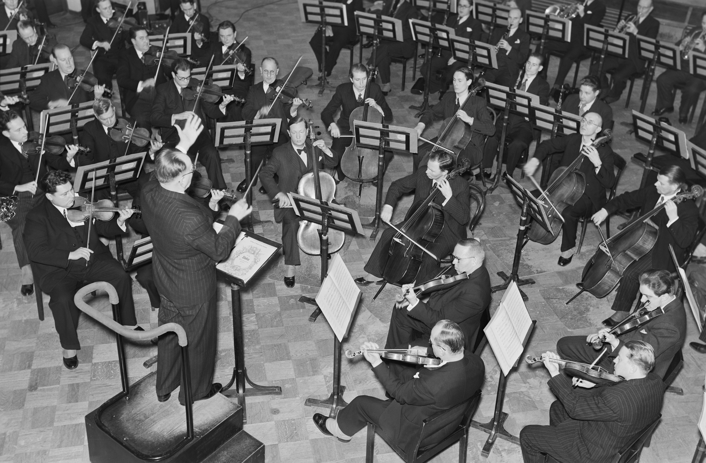
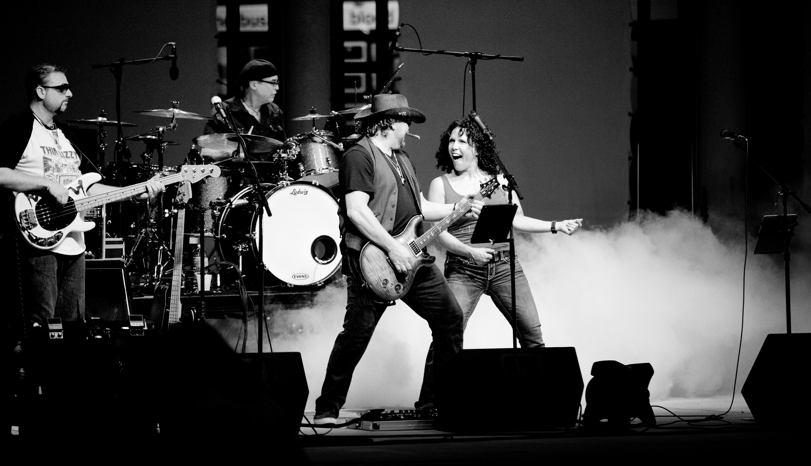

+++
title = "La Programación Agéntica y el estilo Plotter"
date = 2025-11-20T10:00:00-03:00
slug = "programacion-agentica-es-plotter"
tags = ['IA', 'desarrollo', 'programación agéntica', 'plotters vs pantsers']
draft = false 
+++

Jorge Castaño, en [su boletín "Vivir del Software"](https://vivirdelsoftware.substack.com/p/software-en-tiempos-de-ia-spec-driven), propone dos conceptos interesantes: "spec-driven development" y "parallel programming". Me pareció interesante la propuesta, pero al leerlo con atención, me pareció que ambos conceptos caen bajo el paraguas de lo que yo llamo  es estilo **plotter**.

Para mí, la programación en paralelo con agentes de IA es, en esencia, una forma de **eficientar el estilo plotter**. Es hacer lo mismo que siempre han hecho los que planifican antes de codear, pero con una orquesta de IAs ejecutando las partituras que han escrito, siguiendo la metáfora de Castaño.

## Plotters vs Pantsers

Para quienes no leyeron mi post anterior acá les dejo un resumen:

**Plotters** son quienes planifican antes de ejecutar. Diseñan, especifican, crean mapas de ruta y luego implementan. Es el enfoque tradicional de la ingeniería: piensa primero, ejecuta después.

**Pantsers** (del inglés *by the seat of your pants*) son quienes empiezan a codear directamente, explorando el problema mientras lo resuelven. Es programación iterativa, que asume que una especificación completa no puede estar disponible al principio. En un estilo "lean".

Estos conceptos los tomé prestados del mundo de la escritura creativa, donde los autores se dividen entre quienes planifican toda la trama antes de escribir (plotters) y quienes descubren la historia mientras la escriben (pantsers).

En el desarrollo de software, ambos estilos existen y tienen su lugar. Pero con la llegada de las herramientas de IA generativa, estos estilos se están reconfigurando de maneras interesantes.

## Spec-Driven Development: plotters clásicos

Jorge define el SDD como un enfoque donde "antes de escribir una sola línea de código, se define claramente el comportamiento esperado en lenguaje natural". Es decir: especificas todo primero, y luego generas código, tests y documentación a partir de esas especificaciones.

¿Esto te suena familiar? Debería. Es el sueño de décadas de la ingeniería de software. Lo único nuevo aquí es que ahora usamos IA para generar el código desde las especificaciones.

Pero como bien señala Jorge, "en la vida real las especificaciones cambian. Muy a menudo. Demasiado". El SDD puro "huele un poco a consultora de los , a waterfall puro y duro".

Es un enfoque rígido que funciona bien en dominios estables y bien conocidos, pero que se quiebra cuando hay incertidumbre o necesidad de iterar rápido. Porque la realidad es que muchas veces no sabemos exactamente qué queremos hasta que lo vemos funcionando.

## Parallel Programming: plotters con orquesta

Jorge describe la "programación en paralelo" como "múltiples IAs o agentes trabajando en paralelo sobre distintas partes del proyecto".

Su ejemplo es revelador:

> Agente A: convierte las specs en tareas técnicas \
> Agente B: genera el BackEnd \
> Agente C: genera el FrontEnd \
> Agente D: escribe tests \
> Agente E: escribe la documentación \
> Agente F: revisa que se cumplan las especificaciones

Noten algo crucial: **todo parte de las especificaciones**. No hay parallel programming sin especificaciones previas. Los agentes no están improvisando, están ejecutando un plan.

Es decir, esto sigue siendo 100% plotter. La diferencia es que ahora tienes múltiples ejecutores trabajando en paralelo sobre tu diseño previo.

Como dice Jorge magistralmente: "Las especificaciones son la partitura y las IAs son tu orquesta. Pero si no pones tú el orden, tendrás ruido en vez de música".

## La eficiencia en el enfoque plotter

Aquí está mi tesis: la programación agéntica no cambia el paradigma plotter vs pantser. Lo que hace es **volver el enfoque plotter más eficiente**.

Tradicionalmente, el problema de ser plotter era el tiempo. Diseñar especificaciones detalladas, crear arquitecturas, definir interfaces... todo eso toma tiempo. Y cuando las cosas cambian (que siempre cambian), tienes que rediseñar y re-implementar. Todo eso es costoso.

Pero ahora, con agentes de IA, el costo de implementación se reduce dramáticamente. Si tus especificaciones cambian, no es gran cosa: reescribes el spec y dejas que los agentes regeneren el código. El ciclo diseño-implementación-rediseño se acelera.

De repente, ser plotter no es tan costoso como antes. Y puede iterar, y fallar rápido. Una metodología tradicional se ha vuelto ágil, con ayuda de la IA. Esto es interesante, y provocador.

## ¿Y qué pasa con los pantsers?

La pregunta es si hemos eficientado el enfoque de cascada, gracias a los agentes, ¿vale la pena persistir con el estilo pantser? ¿Se diluyen las fronteras entre los métodos ágiles y los tradicionales?

Jorge dice que necesitas "un ser humano coordinando y revisando el código. Esto por ahora no se puede delegar". . Alguien tiene que ser el director de orquesta. Y también reconoce que el cambio de contexto puede volver loco al director de orquesta.

El director de orquesta necesita una partitura. Necesita especificaciones.

El pantser es otro tipo de músico, alguien más acostumbrado a las jam sessions. Un músico de jazz, si es virtuoso, mejor.

El estilo plotter es música clásica, el modo pantser es rock o jazz.

Beethoven, Vivaldi, versus Dave Mathews Band o The Allman Brothers.

## La verdadera ventaja competitiva

¿Será que estamos ante una **profesionalización forzosa** del desarrollo de software?

Me explico. Una cosa interesante que estamos observando, es que el vibe coding, al empezar a fracasar, o generar más dolores de cabeza, les muestra a la gente que viene de afuera, o aquellos que creen que ahora ya no se necesita saber programar, que deben tener un método. Y algunos descubren, y otros re descubren, la ingeniería de software.

Lo que cambia con IA, es que la velocidad de ejecución parece que ya no es el cuello de botella.
El cuello de botella es **la claridad de pensamiento**. Qué tan bien puedes especificar lo que quieres. Qué tan coherente es tu arquitectura. Qué tan bien puedes coordinar múltiples agentes trabajando en paralelo. Todo aquello que los programadores sabemos hacer.

O sea, el desarrollo de software basado en IA requiere saber programar. Pero qué sorpresa!

Los buenos plotters van a tener una ventaja en este nuevo mundo. Porque saben pensar antes de ejecutar. Saben diseñar sistemas coherentes. Saben escribir especificaciones claras.

Y ahora tienen una orquesta de IAs para ejecutar esos diseños a una velocidad que antes era imposible.

## Los riesgos del optimismo tecnológico

Pero cuidado. Como bien advierte Jorge, está el "peligro de añadir código basura infinito si no te encargas de revisar en profundidad todo lo que la IA haya generado". Y agrega algo que me parece crítico: "el continuo cambio de contexto te puede destrozar el cerebro antes de tiempo".

Esto es real. Tener seis agentes trabajando en paralelo suena genial hasta que tienes que estar revisando el output de seis agentes, todos generando código al mismo tiempo, todos potencialmente con inconsistencias entre sí.

La carga cognitiva puede ser brutal.

Por eso creo que la programación agéntica efectiva no es solo "lanza mil agentes y deja que hagan magia". Es un arte más sutil:

1. **Especifica con claridad** lo que quieres (plotter mindset)
2. **Descompón inteligentemente** en tareas que puedan ejecutarse en paralelo
3. **Coordina las dependencias** entre agentes (el Front necesita esperar al Back)
4. **Revisa críticamente** el output, sin asumir que la IA siempre acierta
5. **Itera el diseño** cuando encuentres problemas en la implementación

Es un ciclo. No es "especifica una vez y listo". Es "especifica, ejecuta con agentes, revisa, ajusta especificaciones, re-ejecuta".

¿Pueden los pantser beneficiarse de la programación paralela con agentes? Por su puesto, pero probablemente no necesitarán una orquesta, sino que un "power trio".  

Yo creo que el estilo pantser, para que sea exitoso, y no derive en el vibe coding, o en pura improvisación, requiere de iteraciones cortas, pasos de cierva como hablábamos antes.
Una topología de agentes muy compleja puede complicar este estilo, pues queremos ser lean, recordemos, ese es un principio esencial de este estilo..

## El nuevo rol del desarrollador

Jorge termina su artículo con una pregunta: "¿nuevos marcos de trabajo o humo fresco?"

Mi respuesta: **ni lo uno ni lo otro**. No son marcos de trabajo completamente nuevos porque la idea de especificar antes de implementar es vieja como la ingeniería. Pero tampoco es humo, porque la capacidad de ejecutar esas especificaciones con múltiples agentes de IA sí es cualitativamente nueva.

Las habilidades de ingeniería de software tradicional: diseño, arquitectura, especificación, se vuelven más valiosas, no menos.

Entonces, volviendo a mi tesis inicial: **la programación agéntica es una forma de eficientar el estilo plotter**.

No es un paradigma nuevo. Es el enfoque clásico, conservador si quieren, de diseñar primero, ejecutar después, pero con herramientas nuevas que hacen la ejecución muchísimo más rápida.

Y eso cambia todo. Porque ahora ser plotter no significa ser lento. Significa ser rápido Y riguroso. Puedes iterar rápido sobre diseños bien pensados.

Los plotters que abracen estas herramientas, que aprendan a escribir buenas especificaciones y a coordinar orquestas de IAs, van a tener una ventaja competitiva brutal.

**Las herramientas amplifican tus habilidades**. Si eres bueno diseñando sistemas, la IA te puede ayudar. Si no tienes ni idea de arquitectura, la IA solo te ayuda a generar basura más rápido.

Una conclusión adicional e interesante que podríamos sacar es, que con apoyo de la IA, las metodologías clásicas, tienen la una oportunidad de mejorar y renovarse.

Si agilidad está en crisis, con estos nuevos escenarios y herramientas, los "clásicos" tienen nuevas armas en su arsenal para defenderse, y criticar a los agilistas. El estilo en cascada no se ve tan mal si las etapas se ejecutan con ayuda de agentes. Un método iterativo incremental se ve potenciado con agentes. Etcétera.

Esto me parece interesante, las discusiones se pueden volver interesantes, o estériles, el tiempo dirá.

Lo que sí importa, es que la ingeniería de software debe renovarse y aceptar que la IA la está transformando.

Tanto en los métodos clásicos (plotters), como en los ágiles o lean (pantsers), el impacto de la IA es innegable.

---

*¿Qué opinas tú? ¿Eres plotter o pantser? ¿Cómo estás usando (o pensando usar) agentes de IA en tu flujo de trabajo?
Será que la brecha y discusión de si es mejor el estilo clásico o el estilo lean, quede en el pasado, y quizás las diferencias desaparezcan con estas nuevas tecnologías?*

Si te gustó el contenido, te invito a unirte a [mi Patreon](https://www.patreon.com/lnds) donde podemos continuar la discusión.
