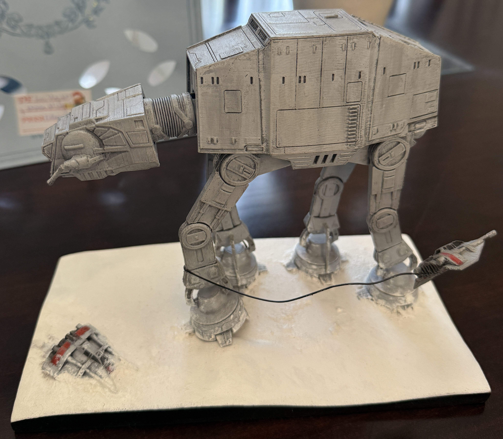
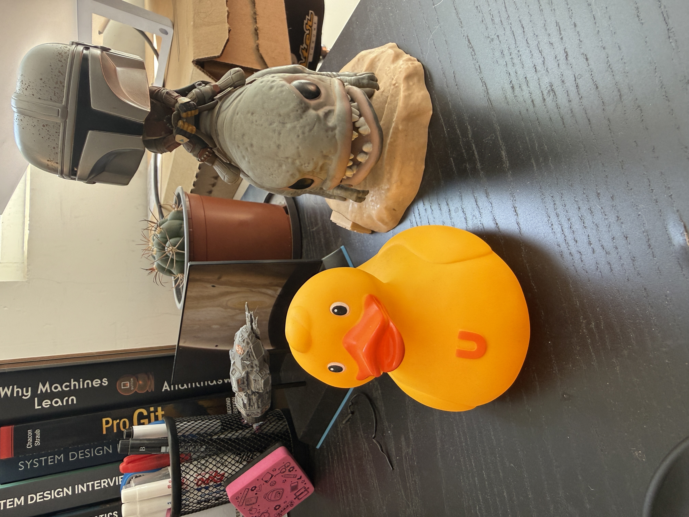
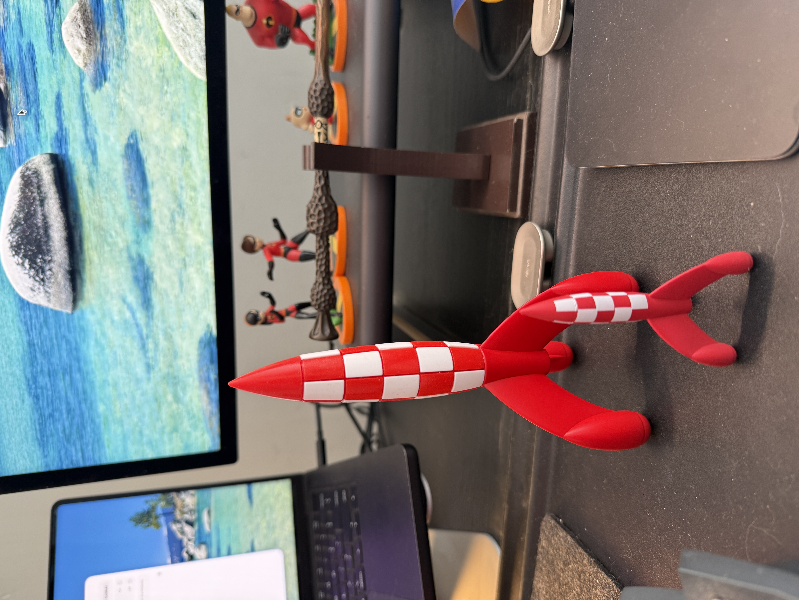

+++
date = '2025-12-25T10:00:00-03:00'
draft = false 
title = 'Juguetes'
slug = 'juguetes'
tags = ['Navidad', 'personal', 'juguetes']
+++

Hace unos años empecé una tradición, que consiste  publicar para estas fechas fotografías de juguetes que he ido coleccionando y que me acompañan en mi entorno de trabajo.

La idea es que compartamos en los comentarios esos accesorios divertidos que nos acompañan todo el año.

Esta Navidad mi familia me sorprendió con este hermoso AT-AT al que tendré que hacerle espacio en mi escritorio.

Este patito apareció luego que el mío desapareciera por unos días, como no lo encontrábamos mis hijos me compraron este, el problema es que parece que tiene asma :D (No se preocupen, mi super pato apareció días después que este amiguito llegó).

Estos cohetes al estilo del comic "Tin Tin: Objetivo la Luna", los adquirí en Bélgica durante mi viaje a Europea este año, un diseño que siempre me ha gustado, y que tenía que estar en mi colección de naves espaciales.

Y ahora tu turno. ¿Qué juguetes adornan tu escritorio o lugar de trabajo?
Me gustaría que los compartas en los comentarios.

¡Feliz Navidad!
