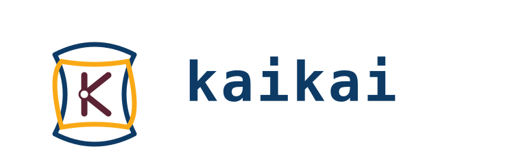

+++
date = '2026-05-21T10:00:00-03:00'
title = 'Programación simple con kaikai'
slug = "programacion-simple-con-kaikai"
tags = ["kaikai", "lenguajes de programación", "programación funcional", "efectos algebraicos", "compiladores", "diseño de lenguajes"]
draft = false
+++

> *"Simplicity is prerequisite for reliability."* — Edsger Dijkstra

En el [post anterior](/blog/lnds/2026/05/17/metodo-importa-mas-que-modelo/) conté el método: cómo construir un compilador completo en un mes mientras la vida sigue. Pero deliberadamente no hablé del lenguaje. La razón era muy simple, el mes aún no se cumplía. Hoy es el día.

Me propuse construir, en un mes y usando la IA, un compilador completo para un lenguaje que llevo más de 10 años diseñando.
¿Fue exitoso el experimento? Yo creo que sí, pero hay matices y aprendizajes que dejaré para el próximo post. Disculpen que les cuente toda la historia en partes, pero lo primero es lo primero, y ahora quiero introducir el lenguaje.

Hace muchos años que vengo masticando la idea de un lenguaje funcional, de propósito general, que yo de verdad pueda usar en mis proyectos personales e incluso en mi trabajo (a ver si lo logro). En la universidad aprendí a construir compiladores, y quedé encantado con el diseño de lenguajes de programación. También diseñé lenguajes de dominio específico para resolver problemas reales.

En 2017 di una charla titulada "Esos raros lenguajes nuevos" donde explico, de una manera divertida, por qué hay tantos lenguajes de programación; [el video está en YouTube](https://www.youtube.com/watch?v=Hp9HwLPYkjI).
Ahí introduje Ogú, un lenguaje que diseñé y que en realidad es un prototipo del lenguaje que voy a presentar hoy.
La historia de cómo armé ese compilador está escrita en [Fake it till you make it](/blog/lnds/2017/03/01/fake-it-till-you-make-it/).

Hoy les voy a mostrar kaikai. Primero hablemos del nombre.

## Kaikai



El kaikai es un juego rapanui. Según el [SIGPA](https://www.sigpa.cl/ficha-elemento/kai-kai-de-rapa-nui):

> Es una práctica donde se arma una figura o “ideograma” entrelazando los hilos entre los dedos de las manos, ayudándose de la boca o pies. Se asocia a un relato recitado llamado pata’u ta’u. A través de esta tradición se traspasan los conocimientos sobre diversas áreas de la vida como las artes, la agricultura o la pesca, entre otros.

Es el juego del cordel, el cat's cradle en inglés, o el ayatori japonés. Pero en rapanui se enlaza con la tradición oral y la poesía.

Inicialmente estaba pensando en el kai kai de la mitología mapuche, pero cuando descubrí el kaikai rapanui el click fue inmediato, porque me recordó la famosa charla de Rich Hickey titulada ["Simple Made Easy"](https://www.infoq.com/presentations/Simple-Made-Easy/).

En la charla, Hickey discute la diferencia entre simple y complejo, citando el origen etimológico de los términos. En su origen, "complejo" significa "estar entrelazado". "Simple", por otro lado, implica un único pliegue o una sola hebra de una trenza.

Y el kaikai es eso, un juego en que con solo una cuerda, mediante movimientos hábiles y simples, construyes figuras complejas.

## Mi primer programa

En la charla que les mencioné, comento que lo primero que aprendí a programar fue un conversor entre grados Celsius y Fahrenheit. Bueno, para seguir la tradición, y porque es lo único que sé programar, les muestro cómo sería en kaikai:

```kaikai
# conversor de temperaturas 

unit F
unit C

const f2c : Real<F/C> = 9.0<F>/5.0<C>
const c2f : Real<C/F> = 5.0<C>/9.0<F>

fn celsius_to_fahrenheit(c : Real<C>) : Real<F> = (c * f2c) + 32.0<F>

fn fahrenheit_to_celsius(f : Real<F>) : Real<C> = (f - 32.0<F>) * c2f

fn main() {
    let c = 35.0<C>
    let f = celsius_to_fahrenheit(c)
    println("#{c} -> #{f}")
    let f = 100.0<F>
    let c = fahrenheit_to_celsius(f)
    println("#{f} -> #{c}")
  }
```

Este sencillo programa introduce varias características de kaikai.

Los comentarios empiezan con `#`. Luego lo que sigue son dos definiciones de unidades de medida F y C. Por ejemplo, `unit F` define la unidad F, para representar los grados Fahrenheit.

Esta es una característica de F# que tomé, porque resuelve un montón de errores.

Piensen en una aplicación fintech en que tienen que convertir de euros a dólares: si mezclan monedas, puede ser un desastre. Las unidades de medida (UoM) extienden el sistema de tipos (técnicamente le agregan un "kind" al tipo).

Si la NASA hubiera usado kaikai, el fallo del [Mars Climate Orbiter](https://es.wikipedia.org/wiki/Mars_Climate_Orbiter) no habría ocurrido.

Aparte de las UoM, kaikai no parece muy novedoso. Pero ¿qué tal si les digo que en este programa se está mostrando el uso de efectos algebraicos y no te das cuenta?

## Efectos algebraicos

¡Efectos qué!


No quiero asustarte. En realidad es un concepto muy simple, pero que tiene mucha teoría detrás, y kaikai es de los pocos lenguajes que implementa esta característica.

En [Revelaciones](/blog/lnds/2015/10/01/revelaciones/) les explico, de una forma mística, como una epifanía casi religiosa, que todo programa útil debe interactuar con el mundo. Eso rompe la pureza que prometen los lenguajes funcionales.

El camino que siguieron los creadores de lenguajes funcionales puros como Haskell fue la introducción de la teoría de categorías: algo bastante complicado, que busca encapsular los efectos que ocurren en un programa.

Cuando escribes en la consola, estás produciendo un efecto lateral. Cuando escribes en la base de datos, o cuando lees desde la base de datos, estás bajo la influencia de un efecto.

En el post expliqué que hay 4 jinetes que afectan a nuestros programas:

- Fallo: tus programas pueden fallar por miles de razones; esto tradicionalmente se maneja con excepciones (try/catch).
- Configuración: el comportamiento de tu programa se ve afectado por la configuración del entorno en que está corriendo.
- Incerteza: una función pura asocia una entrada a una sola salida. Eso se conoce como transparencia referencial. Pero hay funciones no deterministas, porque el resultado depende de otros factores: el resultado de una consulta a la base de datos, la respuesta de un LLM, etc.
- Destrucción: es el tipo de efecto más común; imprimes en la consola o en una impresora, mandas un email, escribes un archivo, borras otro, etc.

Para kaikai, todos estos son efectos. Un `println` es un efecto. En particular, es parte del efecto `Stdout` (que a su vez es parte de un efecto que los agrupa: `Io`).
Consultar las variables de ambiente es parte del efecto `Env`. Para manejar una excepción usas el efecto `Fail`.
Para concurrencia usas el efecto `Fiber` o el efecto `Actor`. Y en otras extensiones fuera de la biblioteca estándar tienes cosas como el efecto `Db`.

¿Cómo se declara un efecto? Veamos:

```kaikai
effect Log {
  log(msg: String) : Unit
}
```

Y se usa así:

```kaikai
fn greet(name: String) : Unit / Log {
  Log.log("hello, " ++ name)
}

fn main() {
  handle {
    greet("kaikai")
    greet("world")
  } with Log {
    log(msg, resume) -> {
      println("[INFO] " ++ msg)
      resume(())
    }
  }
}
```

Lo que ocurre aquí es que tú debes manejar el efecto o declarar que no lo vas a manejar, y asumes que quien usa tu función lo va a manejar.

En este ejemplo, `greet` declara que no retorna nada (tipo `Unit`) y que tiene un efecto dentro (esto se declara después de la barra '/'). La firma de la función declara que llama a un efecto, pero no lo maneja.

La función `main` se encarga de manejar `Log` usando la construcción `handle ... with`.

Lo hermoso de los efectos es que agrupan todos estos conceptos en uno. Concurrencia, excepciones, logs, entrada/salida, etc. Son todos efectos. No tienes que aprender conceptos diferentes o estructuras de lenguaje distintas para manejar cada caso.

Piensen en `async` en JavaScript o Rust, y otros lenguajes. Una cosa que ocurre es que cuando etiquetas una función con `async`, contamina toda la cadena, y tienes que empezar a colocar `async` o `await` por todos lados; aparte de incómodo, empieza a perder el sentido. En kaikai esto es un efecto más, la sintaxis va en la firma, y lo manejas donde corresponde, no en otro lado.

Los efectos, por supuesto, pueden definir handlers por defecto para mejorar su ergonomía. Por eso puedes usar `println` sin tener que escribir un bloque `handle`.

## Pipes, pipes everywhere

Kaikai tiene el operador `|>` de Elixir y otros lenguajes, pero también tiene otras extensiones. El operador `|` es un map, `||` es un flatmap, y `|?` es un filter. Esto es un capricho, pero es útil.

Veamos un ejemplo:

```kaikai
fn rango_loop(i: Int, n: Int, acc: [Int]) : [Int]
  = if i > n { list_reverse(acc) } else { rango_loop(i + 1, n, [i, ...acc]) }

fn rango(n: Int) : [Int] = rango_loop(1, n, [])

fn cuadrado(n: Int) : Int = n * n

fn divisores(n: Int) : [Int] = [1, n]

fn es_par(n: Int) : Bool = n % 2 == 0

fn main() {
  let total = rango(4)                # [1, 2, 3, 4]
    | cuadrado                        # [1, 4, 9, 16]      (map)
    || divisores                      # [1, 1, 1, 4, 1, 9, 1, 16] (flat-map)
    |? es_par                         # [4, 16]            (filter)
    |> list.sum                       # 20                 (apply)

  println("total=#{total}")
}
```

Esto permite escribir menos, y en mi opinión a veces es más claro que escribir `|> filter`.

Ah, `|>` permite definir dónde vas a pasar el argumento. Por ejemplo:

```kaikai

fn foo(x: Int, y: Int, z: Int) : Int = ?

fn main() {
   2 |> foo(3, _, 4)
}
```

Aquí el valor 2 se pasa en la posición indicada por `_`.

Por cierto, puedes hacer que tu tipo soporte pipes si implementas las funciones `map`, `flat_map` y `filter`.
Los pipes son un caso especial de protocolo.

Los protocolos son similares a las interfaces o a los traits. En kaikai, los protocolos son más parecidos a las interfaces de Go.

Otra cosa: el `?` es un "hole", una característica que va en la dirección de ayudar a las IA a escribir código kaikai.

## Agent Friendly

Los holes son un mecanismo con mucha historia, siendo una de las propuestas más recientes el paper de Cyrus Omar, Ian Voysey, Ravi Chugh y Matthew Hammer, "Live Functional Programming with Typed Holes", de 2019.

Tú puedes definir una función así:

```kaikai
fn area_circulo(r : Real<cm>) : Real<cm> = ?area_cms_por_definir
```

Aquí has dejado un agujero llamado `?area_cms_por_definir` que vas a escribir después (o pedirle a un agente que la escriba por ti). El programa va a compilar y, en runtime, fallará al encontrar el hole.

Aparte de los holes, kaikai ayuda a los agentes generando errores ergonómicos, y puedes hacer análisis con una salida en JSON. También tiene comandos como `kai info --json`.

Puedes decirle a tu agente que haga esto:

```
kai info syntax --json 
```

Y va a tener información sobre la sintaxis de kaikai (la versión sin JSON la puedes leer tú).

Si quieres saber sobre efectos haces: `kai info effects`.

Hay más usos de los holes, y otras características agent friendly, que puedes explorar y aprender por tu cuenta en el libro.

¡Sí, hay un libro!

## El libro

Por supuesto, el lanzamiento del lenguaje incluye más cosas que el compilador. Eso es parte del experimento.

Kaikai sale al mundo con un sitio web, [https://kaikai-lang.org/](https://kaikai-lang.org/), y un libro que puedes descargar de ahí mismo (en español e inglés).

El libro lo escribió un agente y yo actué de editor; el prólogo lo escribí a mano (igual que este post).

También nace con algunos paquetes básicos: [ahu](https://github.com/kaikailang-org/ahu), un framework para construir aplicaciones concurrentes; [kohau](https://github.com/kaikailang-org/kohau), un driver de bases de datos para sqlite (y, en el futuro, postgres); y [henua](https://github.com/kaikailang-org/henua), un framework para construir aplicaciones DDD (implementa un Repository y un EventBus).

Y, por supuesto, plugins para Neovim y Visual Studio Code (para quienes siguen sufriendo con esa cosa).

Sí, todo construido con agentes trabajando en paralelo. Pero esa es la tercera parte de la historia.

## ¿Qué viene ahora?

Yo creo que las IA y los humanos vamos a necesitar lenguajes nuevos. Hay ahora una tendencia a usar Rust porque la IA lo permite, porque las complejidades de ese lenguaje se pueden abordar. Pero, en mi opinión, hay un espacio para lenguajes tan poderosos como Rust pero no tan complicados. Hay características de kaikai que rivalizan con Rust, que por espacio no puedo exponer aquí, pero que contaré más adelante.

Bueno, este es el lanzamiento oficial de kaikai. Ahora ustedes me tienen que ayudar, porque no está listo para producción. Hay varias mejoras que implementar aún, pero ya puedes usarlo para experimentar, crear frameworks y bibliotecas, y validar que es posible usar kaikai en producción. Si encuentras algo, o quieres saber si soportaremos alguna feature, crea un issue en GitHub y veré qué se puede hacer.

Les pido divulgarlo. Yo me encargaré de promoverlo entre colegas y amigos, y por supuesto también en la tecnosfera en inglés, porque kaikai es para todo el mundo. Y creo que es un aporte novedoso.

Si les gusta, pueden apoyarme divulgándolo, inscribiéndose en mi [Patreon](https://www.patreon.com/lnds), o simplemente difundiendo este artículo.
